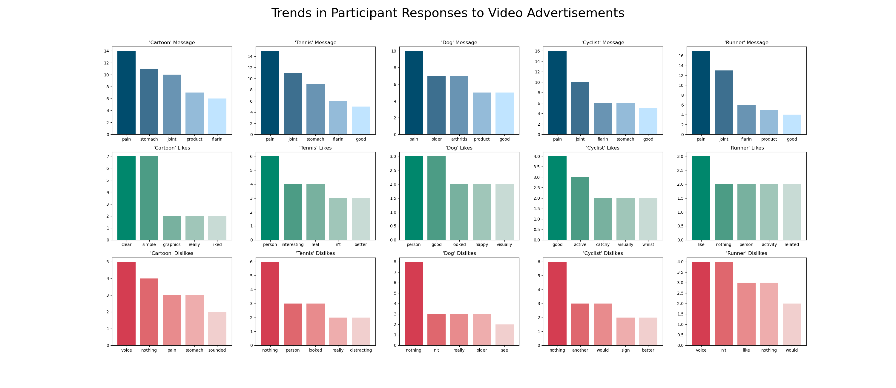

# Flarin Video Advertising Comparison

For this project, I had worked with the client to design a form for their consumer research. Following the survey, further investigation was required to analyse the free-text fields in the questionnaire. These were:
1. What is the message of this video?
2. What did you like about this video?
3. What did you dislike about this video?

The client wanted the analytics presented in a dashboard style, all in one figure.

## Preprocessing

I first created a function preprocess_data(), which tokenized each row in a given column and removed all stopwords and punctuation, returning the processed column.\
\
A second function, generate_data(), produces a dictionary from the processed data of the word frequencies for that column and returns the n most frequent words.\
\
The code after preprocesses and generates the data for the display from each column (representing a video/question).

## Plotting

The frequency plots were plotted on a 3 x 5 grid of subplots. This allows for comparison across videos, as well as across questions within the same video. The final dashboard is shown here:

